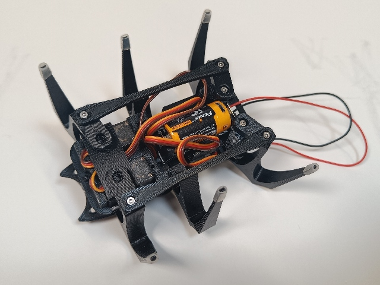
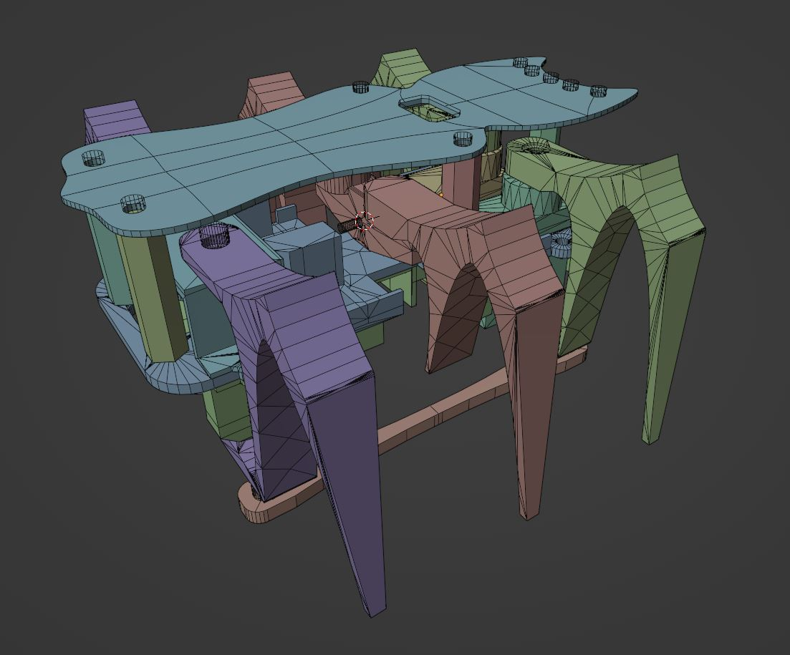

## Robotling2 für Blender

Kontakt: Carsten, caw beim make-magazin.de

Übersicht |
:--|
[]https://github.com/teuler/robotling2/blob/main/mods/c_wartmann/Blendling.jpg)

* In Blender importiert für die Blenderheads
* "Freestyle" ohne Platine
* Insektoides Design der der oberen Platte, mehr Platz für Experimente
* Ein kleiner USB-ladbarer LiIon Akku passt inkl. Halter zwischen die Beine
* Keine Kugellager, stattdessen dienen mehr 
  M2 Schrauben als "Lager"
* M3 Nylon Standoffs als Abstandhalter

